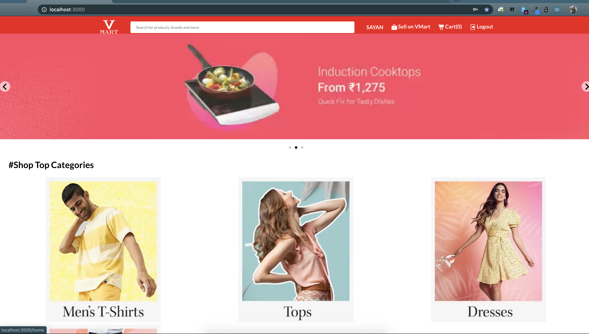
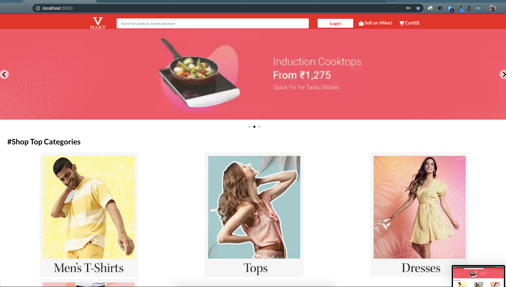
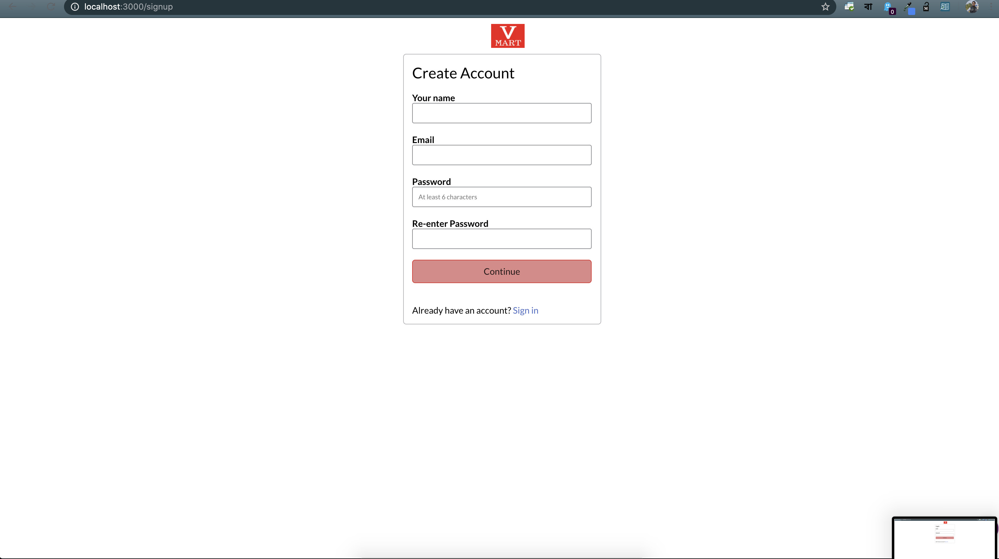
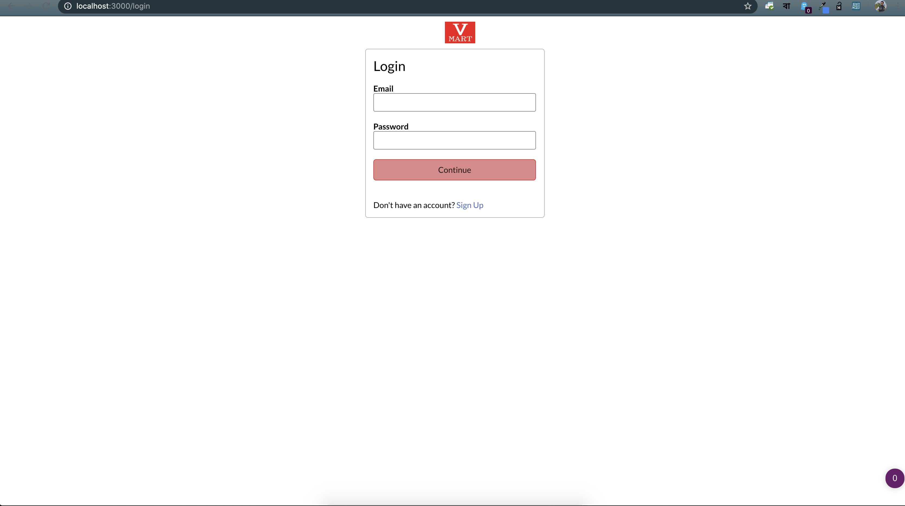
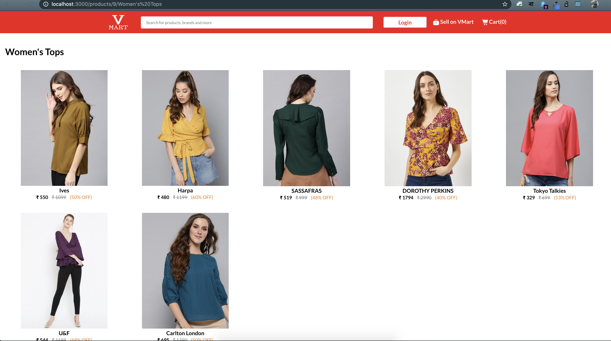
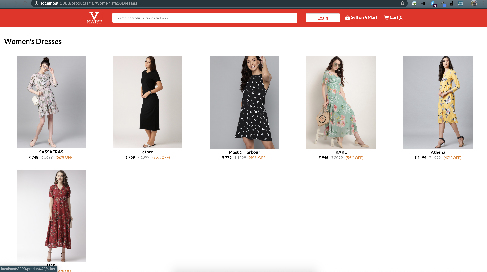

# VMart

## VyntraMart(Online Cloth Mart)

# Objective:

  We are a company that sell Trendy clothes. Most of our sales comes through our popular ecommerce web site that has very high search engine rakings. We are planning to re-engineer our ecommerce web site since it is currently experiencing some serious scalability issues.
Our top priority in this re-engineering effort is the performance and user experience. We are planning to launch a new e-commerce mobile app as part of this re-engineering effort. In addition to this, we need to add a good recommendation engine to both web and mobile apps to improve our sales.

# Application Overview:
Application to include the below modules as a basic ones and additionally, value adds can be included.
     
     1. eCart
     2. Order Management & Status tracking
     3. Admin Interface – User & Product Management
     4. Payment Gateway – Mock Payment related interfaces.
     5. Secured authentication mechanism
     6. Tax Calculations – Mock this service
    
More Details:
     The admin interface of the current application that is used to manage product catalog and inventory works fine for now and we will continue to use it with the new customer facing application. The new application should integrate well with this. However, if the database design of the existing application imposes a negative impact on new application performance, it is ok to duplicate this data in the new application database.
  
   The current application supports two type of authentications. Some users use their Facebook accounts for the authentication. Our system manages the credentials of the other users. The new application should support both of these user types. The users of Facebook accounts should be able to share the fashion items of this site with their Facebook friends, so that they can share their comments and likes.
    
   The current application uses Gateway1 as the payment gateway. We expect the new application to support PayPal an alternative payment method, in addition to Gateway1.
    
   Our current application uses TaxCalc1 service for tax calculations. The new application should continue to use that service. This is a SaaS application. The cost of using it depends on the number of calls we make. Therefore it is important to minimize the number of calls to this service to minimize the cost.
    
   We use QuickBook SaaS cloud application for accounting and a third party FullFillment1 application to manage our order fulfillment process. This new application should integrate well with them.
    
    
# Technology Stack

| Layer  | Technology |
| ------------- | ------------- |
| Presentation Layer  | ReactJS, BootStrap, CSS3/SASS  |
| Server Side Implementation  | Spring Boot Spring Rest Controller ,  Spring Security ,  Spring AOP ,  Spring Hibernate or JPA  |
| Database  | MYSQL  |

<<<<<<< HEAD
# The Application 

!
! 
The Home page contains 4 part 
1. The Header - There are 3 Part. 
    A. A demo Logo in Left 
    B. A Search Bar 
    C. A Login Button , It'll Appear if the user is not Logged'in , If the user is LoggedIn, Then It'll show the User name
    D. A Seller Button, to access the seller dashboard 
    E. Cart(0) It'll show the cart item
    F. A LogOut Button which appears only when the user in Loged In.
1. Promotion Banner part -  Where slide show of promitional banner will displaied.
2. The Shop Top Categories part - There some top shop category will be displaied. On click over any category, It'll show the listed items in the category.
3. The footer - Company Footer and Basic contact information is provided

!
It is the form to create the user account. To create the account , the user have to provide there Name, Email and Password. 

!
It is the form to login into the user account. Useing there email and password Credential , The user can login there.

!
! 
The Category Page contains the products ubnder a category.

!
! 
Product page is page which contains all the necessary information about a products. 
It Contains the Product Picture , Product Name, Product Descreption , Price and Discounted Prics,
Product Specifications and Seller Name along with Product Code.
||||||| dcf3109
=======
# The Application 

!
! 
The Home page contains 4 part 
1. The Header - There are 3 Part. 
    A. A demo Logo in Left 
    B. A Search Bar 
    C. A Login Button , It'll Appear if the user is not Logged'in , If the user is LoggedIn, Then It'll show the User name
    D. A Seller Button, to access the seller dashboard 
    E. Cart(0) It'll show the cart item
    F. A LogOut Button which appears only when the user in Loged In.
1. Promotion Banner part -  Where slide show of promitional banner will displaied.
2. The Shop Top Categories part - There some top shop category will be displaied. On click over any category, It'll show the listed items in the category.
3. The footer - Company Footer and Basic contact information is provided

!
It is the form to create the user account. To create the account , the user have to provide there Name, Email and Password. 

!
It is the form to login into the user account. Useing there email and password Credential , The user can login there.

!
! 
The Category Page contains the products ubnder a category.

!
! 
Product page is page which contains all the necessary information about a products. 
It Contains the Product Picture , Product Name, Product Descreption , Price and Discounted Prics,
Product Specifications and Seller Name along with Product Code.
>>>>>>> b965055f449e79047a608f70e00968b29d15f73d
